<div align="center">


<h1>SOX ITGC Controls Platform</h1>

<p><strong>The Strategic Governance & Protection Plane for Global IT General Controls and SOX Compliance.</strong></p>

[]()
[]()
[]()

<br/>

> **"Integrity is the foundation of financial trust."** 
> **SOX ITGC Controls (SOX-Ops)** is an institutional-grade platform designed to provide a secure, measurable, and highly automated foundation for global IT General Controls (ITGC) governance. It orchestrates the entire lifecycle—from control definition and automated effectiveness testing to segregation of duties (SoD) and evidence management.

</div>

---

## 🏛️ Executive Summary

Maintaining SOX compliance in a modern, rapid-release cloud environment is a significant challenge. Organizations often fail to pass audits not because of a lack of effort, but because of fragmented control ownership and manual evidence collection that cannot keep pace with ephemeral infrastructure.

This platform provides the **Compliance Governance Plane**. It implements a complete **Compliance Intelligence Framework**, enabling Finance and Internal Audit teams to manage ITGC as a first-class citizen. By automating the collection of signed evidence and the enforcement of SoD matrices, we ensure that the organizational systems are continuously governed, tested, and ready for institutional audits with strategic precision.

---

## 📐 Architecture Storytelling: Principal Reference Models

### 1. Principal Architecture: Global SOX ITGC Compliance & Governance Plane
This diagram illustrates the end-to-end flow from cross-domain control definition to automated evidence collection and immutable audit reporting.

```mermaid
graph LR
    %% Subgraph Definitions
    subgraph ControlDomain["ITGC Control Domains"]
        direction TB
        Access["Access Management (IAM/RBAC)"]
        Change["Change Management (DevOps/CI)"]
        Ops["Systems Operations (Backup/DR)"]
        Data["Data Integrity (Encryption/Audit)"]
    end

    subgraph Intelligence["Compliance Intelligence Engine"]
        direction TB
        API["FastAPI Compliance Gateway"]
        Matrix["Global Control Matrix"]
        SoD["Segregation of Duties Engine"]
        Tester["Automated Effectiveness Tester"]
    end

    subgraph EvidencePlane["Immutable Evidence Plane"]
        direction TB
        Ingest["Automated Evidence Ingestor"]
        Locker["Forensic Evidence Locker (S3/Vault)"]
        Signer["SHA-256 Metadata Signer"]
    end

    subgraph Reporting["Institutional Audit Hub"]
        direction TB
        Dash["Real-Time Compliance Dashboard"]
        Audit["SOX 404 Compliance Report"]
        Deficiency["Deficiency & Remediation Tracker"]
    end

    subgraph DevOps["Compliance-as-Code Orchestration"]
        direction TB
        GH["GitHub Actions (Control CI)"]
        TF["Terraform Compliance Modules"]
        Sentinel["Sentinel / OPA Guardrails"]
    end

    %% Flow Arrows
    ControlDomain -->|1. Map Controls| Matrix
    Matrix -->|2. Validate SoD| SoD
    SoD -->|3. Pass| Tester
    Tester -->|4. Collect Evidence| Ingest
    Ingest -->|5. Sign| Signer
    Signer -->|6. Store| Locker
    
    Locker -->|7. Audit| Dash
    Dash -->|8. Generate| Audit
    Dash -->|9. Alert| Deficiency
    
    GH -->|10. Provision| TF
    TF -->|11. Enforce| Sentinel
    Sentinel -->|12. Guardrails| ControlDomain

    %% Styling
    classDef domain fill:#f5f5f5,stroke:#616161,stroke-width:2px;
    classDef intel fill:#ede7f6,stroke:#311b92,stroke-width:2px;
    classDef evidence fill:#e8f5e9,stroke:#1b5e20,stroke-width:2px;
    classDef report fill:#fce4ec,stroke:#880e4f,stroke-width:2px;
    classDef devops fill:#fffde7,stroke:#f57f17,stroke-width:2px;

    class ControlDomain domain;
    class Intelligence intel;
    class EvidencePlane evidence;
    class Reporting report;
    class DevOps devops;
```

### 2. The ITGC Control Lifecycle: Define to Remediate
The continuous path of maintaining control effectiveness across the enterprise.

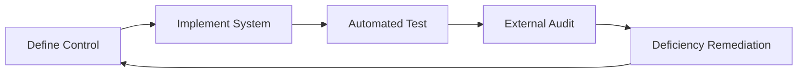

### 3. Four Pillars of ITGC Excellence
Standardizing the core domains required for SOX 404 financial reporting compliance.

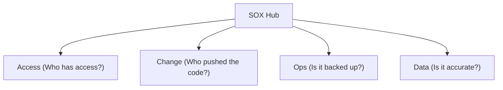

### 4. Automated Evidence Collection Pipeline
The secure path for ingesting and protecting compliance artifacts.

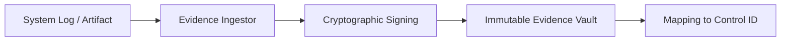

### 5. Change Management Governance Flow
Linking technical deployments to organizational change control policies.

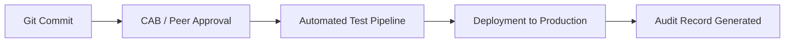

### 6. Identity & Access Governance (IAG)
Managing the lifecycle of user access through automated JML processes.

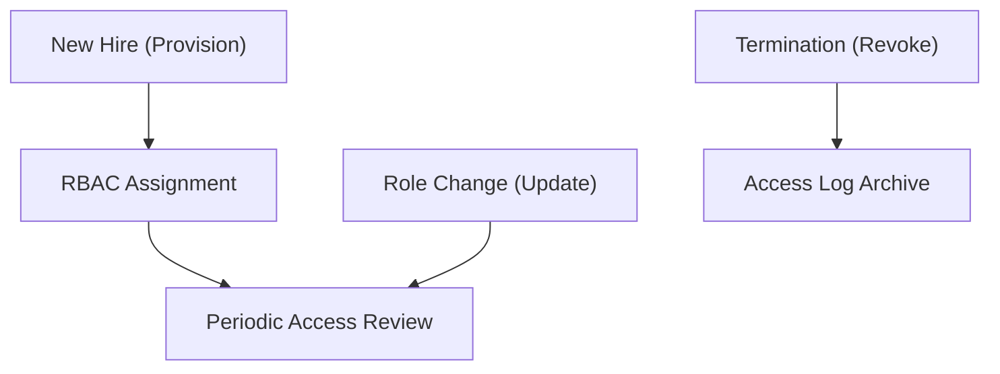

### 7. Separation of Duties (SoD) Conflict Matrix
Preventing high-risk combinations of roles across the global infrastructure.

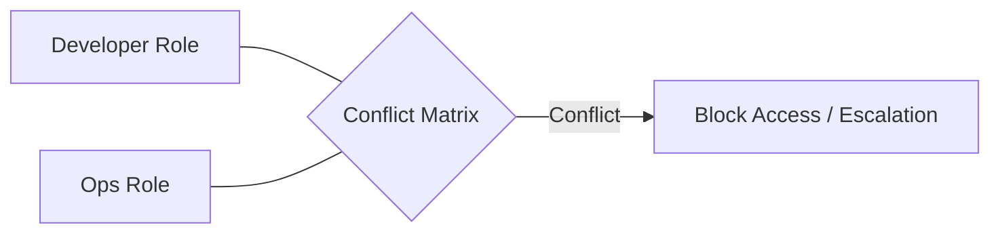

### 8. Vulnerability & Patch Management Loop
Continuous identification and remediation of technical risks.

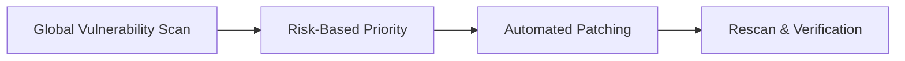

### 9. Disaster Recovery & Backup Integrity Hub
Ensuring financial data is resilient and recoverable under audit conditions.

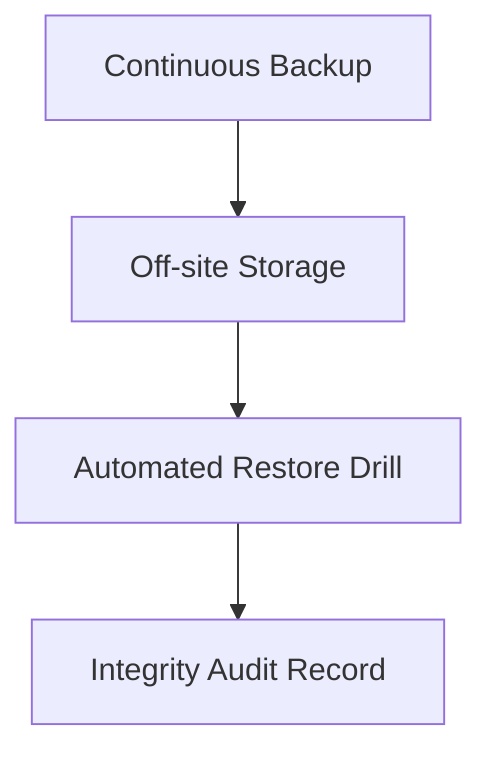

### 10. IaC Compliance Guardrails: Policy-as-Code
Using Sentinel or OPA to enforce SOX-compliant configurations during the provisioning phase.

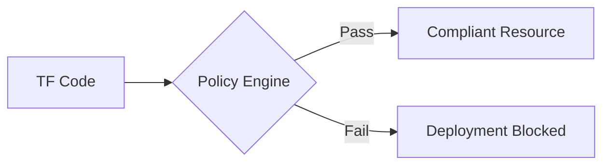

### 11. Metadata Lake for Forensic Audit Readiness
Long-term storage for immutable compliance logs and audit trails.

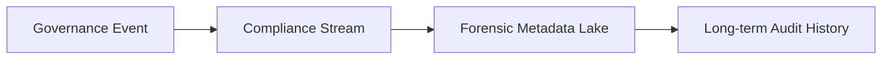

---

## 🏛️ Core Compliance Pillars

1.  **Precision Control Matrix**: Centralized hub for defining ITGC controls across Access, Change, and Operations domains.
2.  **Automated Effectiveness Testing**: Policy-driven engine that continuously validates control performance through automated tests.
3.  **Strategic SoD Governance**: Advanced logic for detecting and preventing Segregation of Duties conflicts across multi-role environments.
4.  **Immutable Evidence Locker**: Secure, long-term storage for compliance artifacts, mapped to specific controls and audit periods.
5.  **Real-time Deficiency Tracking**: Intelligent monitoring of control failures, providing early warning signals and remediation.
6.  **Immutable Audit Record**: Comprehensive logging of every governance action, approval, and review.

---

## 🛠️ Technical Stack & Implementation

### Compliance Engine & APIs
*   **Framework**: Python 3.11+ / FastAPI.
*   **Control Engine**: Strategic management of ITGC controls across multi-domain matrices.
*   **SoD Engine**: Multi-role conflict detection and prevention logic.
*   **Evidence Signer**: Cryptographic signing (SHA-256) of all ingested evidence artifacts.
*   **State Management**: PostgreSQL (Metadata) and S3/Vault (Evidence Storage).

### Compliance Hub (UI)
*   **Framework**: React 18 / Vite.
*   **Theme**: Indigo / Slate (Modern Governance & Compliance aesthetic).
*   **Visualization**: Recharts for control effectiveness trends and risk heatmaps.

### Infrastructure & DevOps
*   **Runtime**: AWS EKS or Azure Kubernetes Service (AKS).
*   **IaC**: Modular Terraform for deploying the compliance hub and evidence pipelines.

---

## 🏗️ IaC Mapping (Module Structure)

| Module | Purpose | Real Services |
| :--- | :--- | :--- |
| **`infrastructure/governance`** | Central management plane | EKS, PostgreSQL, Redis |
| **`infrastructure/evidence`** | Secure artifact storage | S3 Glacier, Vault, KMS |
| **`infrastructure/iam`** | Access and SoD enforcement | Azure AD, AWS IAM, Okta |
| **`infrastructure/logging`** | Audit trail and evidence collectors | CloudWatch, ELK, Splunk |

---

## 🚀 Deployment Guide

### Local Principal Environment
```bash
# Clone the compliance platform
git clone https://github.com/devopstrio/sox-itgc-controls.git
cd sox-itgc-controls

# Configure environment
cp .env.example .env

# Launch the Compliance stack
make up

# Run automated control testing
make test-controls

# Run SoD conflict validation
make validate-sod
```

Access the Compliance Hub Dashboard at `http://localhost:3000`.

---

## 📜 License
Distributed under the MIT License. See `LICENSE` for more information.

---
<div align="center">
  <p>© 2026 Devopstrio. All rights reserved.</p>
</div>
