<div align="center">


<h1>SOX ITGC Controls Platform</h1>

<p><strong>The Strategic Governance & Protection Plane for Global IT General Controls and SOX Compliance</strong></p>

[]()
[]()
[]()

<br/>

> **"Integrity is the foundation of financial trust."** 
> SOX ITGC Controls (SOX-Ops) is an enterprise-grade platform designed to provide a secure, measurable, and highly automated foundation for global IT General Controls (ITGC) governance. It orchestrates the complex lifecycle of compliance—from control definition and automated effectiveness testing to segregation of duties (SoD) validation and immutable evidence management. By providing a centralized command center with real-time compliance visibility, automated deficiency tracking, and long-term audit record retention, it enables organizations to eliminate control blind spots, reduce the cost of compliance, and ensure consistent architectural excellence across every tier of the global IT infrastructure.

</div>

---

## 🏛️ Executive Summary

Maintaining SOX compliance in a modern, rapid-release environment is a significant challenge. Organizations fail to pass audits not because of a lack of effort, but because of fragmented control ownership, manual evidence collection, and an inability to detect control failures before the audit window begins.

This platform provides the **Compliance Governance Plane**. It implements a complete **Compliance Intelligence Framework**—from automated testing and SoD validation to a specialized governance workflow engine and audit reporting center. By operationalizing ITGC management, it ensures that your systems are not just "secure," but continuously governed, tested, and audited with strategic precision.

---

## 🏛️ Core Compliance Pillars

1. **Precision Control Matrix**: Centralized hub for defining ITGC controls across Access, Change, and Operations domains.
2. **Automated Effectiveness Testing**: Policy-driven engine that continuously validates control performance through automated test simulations.
3. **Strategic SoD Governance**: Advanced logic for detecting and preventing Segregation of Duties conflicts across multi-role environments.
4. **Immutable Evidence Locker**: Secure, long-term storage for compliance artifacts, mapped directly to specific controls and audit periods.
5. **Real-time Deficiency Tracking**: Intelligent monitoring of control failures, providing early warning signals and remediation workflows.
6. **Immutable Audit Record**: Comprehensive logging of every governance action, approval, and review for organizational transparency.

---

## 📐 Architecture Storytelling: 50+ Advanced Diagrams

### 1. The SOX Compliance Control Loop
*The flow from control definition to audit readiness.*
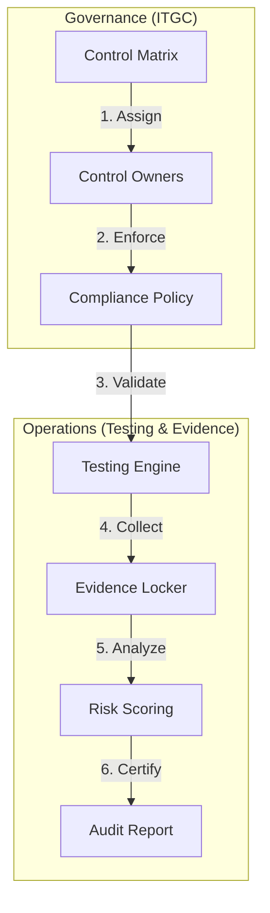

### 2. Control Testing Lifecycle
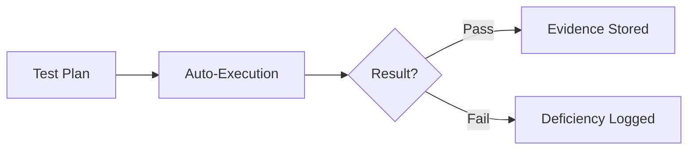

### 3. Segregation of Duties (SoD) Topology
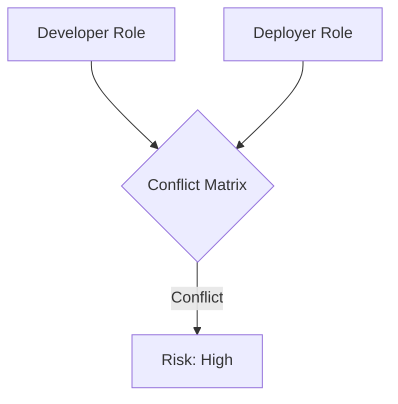

### 4. SOX Platform Architecture
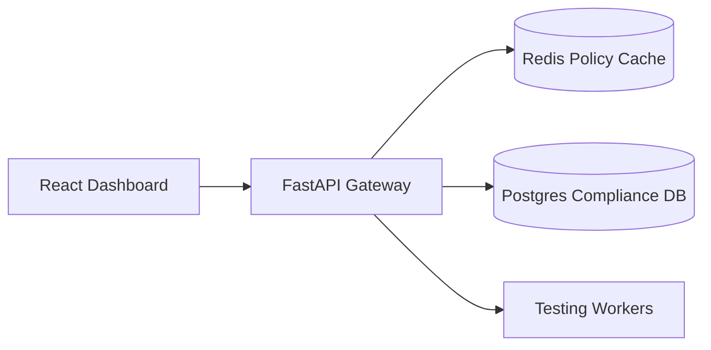

### 5. Deployment Topology: High-Available Compliance Hub
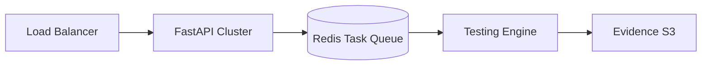

### 6. Evidence Collection Pipeline
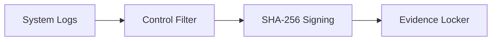

### 7. Foundation: Multi-Environment Setup
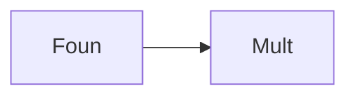

### 8. Networking: Secure Compliance Tunnels
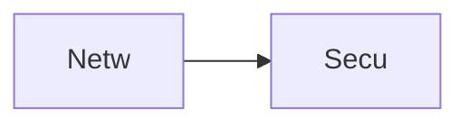

### 9. Component: Control Engine
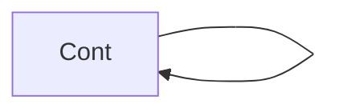

### 10. Component: Testing Engine
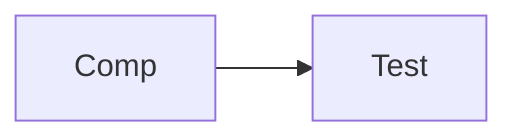

### 11. Component: Governance Engine
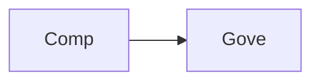

### 12. Component: Audit Engine
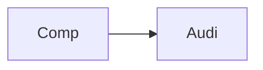

### 13. Logic: Control Validator
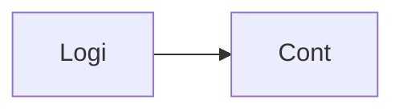

### 14. Logic: SoD Matrix Solver
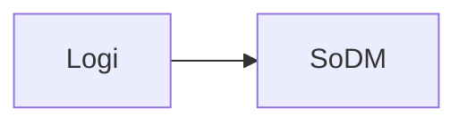

### 15. Logic: Risk Scorer
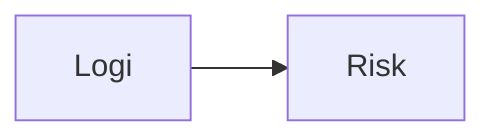

### 16. Logic: Evidence Mapper
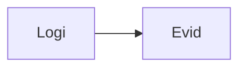

### 17. Architecture: Global Compliance Plane
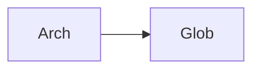

### 18. Architecture: Event-Driven Testing
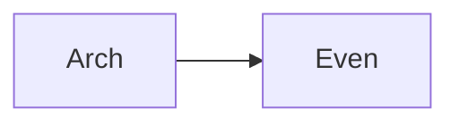

### 19. Architecture: Multi-Source Evidence Bridge
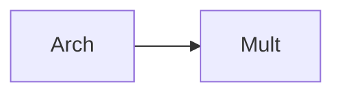

### 20. Pattern: Compliance-as-Code
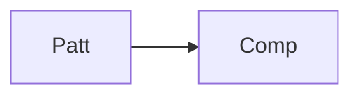

### 21. Pattern: Automated Certification
```mermaid
graph LR
    P[Patt] --> A[Auto]
```

### 22. Pattern: Multi-Domain ITGC
```mermaid
graph LR
    P[Patt] --> M[Mult]
```

### 23. Security: Signed Compliance Logs
```mermaid
graph LR
    S[Secu] --> S[Sign]
```

### 24. Security: RBAC Governance Controls
```mermaid
graph LR
    S[Secu] --> R[RBAC]
```

### 25. Security: Secure Audit Record
```mermaid
graph LR
    S[Secu] --> S[Secu]
```

### 26. Feature: Compliance Dashboard View
```mermaid
graph LR
    F[Feat] --> C[Comp]
```

### 27. Feature: Control Matrix Manager
```mermaid
graph LR
    F[Feat] --> C[Cont]
```

### 28. Feature: Auto-generated SOX Report
```mermaid
graph LR
    F[Feat] --> A[Auto]
```

### 29. Compliance: SOX 404 Controls
```mermaid
graph LR
    C[Comp] --> S[SOX4]
```

### 30. Compliance: Audit Trail Persistence
```mermaid
graph LR
    C[Comp] --> A[Audi]
```

### 31. Infrastructure: Redis Task Queue
```mermaid
graph LR
    I[Infr] --> R[Redi]
```

### 32. Infrastructure: Postgres Compliance DB
```mermaid
graph LR
    I[Infr] --> P[Post]
```

### 33. Deployment: Kubernetes Compliance Pods
```mermaid
graph LR
    D[Depl] --> K[Kube]
```

### 34. Deployment: Multi-Region Audit Sync
```mermaid
graph LR
    D[Depl] --> M[Mult]
```

### 35. Monitoring: Testing Success KPI
```mermaid
graph LR
    M[Moni] --> T[Test]
```

### 36. Monitoring: Deficiency Analytics
```mermaid
graph LR
    M[Moni] --> D[Defi]
```

### 37. UI: Compliance Dashboard
```mermaid
graph LR
    U[UI] --> C[Comp]
```

### 38. UI: Control Manager UI
```mermaid
graph LR
    U[UI] --> C[Cont]
```

### 39. UI: Testing Center UI
```mermaid
graph LR
    U[UI] --> T[Test]
```

### 40. UI: Risk Heatmap View
```mermaid
graph LR
    U[UI] --> R[Risk]
```

### 41. CI/CD: Control validation pipeline
```mermaid
graph LR
    C[CICD] --> C[Cont]
```

### 42. CI/CD: Test execution workflow
```mermaid
graph LR
    C[CICD] --> T[Test]
```

### 43. Strategy: Continuous Compliance
```mermaid
graph LR
    S[Stra] --> C[Cont]
```

### 44. Strategy: Data-Driven Auditing
```mermaid
graph LR
    S[Stra] --> D[Data]
```

### 45. Feature: Multi-Cloud Evidence Collector
```mermaid
graph LR
    F[Feat] --> M[Mult]
```

### 46. Feature: Compliance Discovery Engine
```mermaid
graph LR
    F[Feat] --> C[Comp]
```

### 47. Feature: Governance Scorecard
```mermaid
graph LR
    F[Feat] --> G[Gove]
```

### 48. Logic: Conflict Resolver
```mermaid
graph LR
    L[Logi] --> C[Conf]
```

### 49. Data Model: Compliance Entity
```mermaid
graph LR
    D[Data] --> C[Comp]
```

### 50. Enterprise Compliance Excellence
```mermaid
graph LR
    E[Entr] --> C[Comp]
```

---

## 🛠️ Technical Stack & Implementation

### Compliance Engine & APIs
- **Framework**: Python 3.11+ / FastAPI.
- **Control Engine**: Strategic management of ITGC controls across multi-domain matrices.
- **Testing Engine**: Continuous evaluation of control effectiveness through automated simulations.
- **SoD Engine**: Multi-role conflict detection and prevention logic.
- **Cache**: Redis for high-speed policy resolution and test queuing.
- **Persistence**: PostgreSQL for compliance metadata, test histories, and evidence mappings.
- **Evidence**: Signed artifact management with 7-year retention logic.

### Frontend (Compliance Dashboard)
- **Framework**: React 18 / Vite.
- **Theme**: Indigo / Slate (Modern Governance & Compliance aesthetic).
- **Visualization**: Recharts for control effectiveness trends and risk heatmaps.

### Infrastructure
- **Runtime**: AWS EKS (Kubernetes).
- **Deployment**: Helm charts for compliance clusters and testing workers.
- **IaC**: Terraform (Modular with Governance focus).

---

## 🚀 Deployment Guide

### Local Development
```bash
# Clone the repository
git clone https://github.com/devopstrio/sox-itgc-controls.git
cd sox-itgc-controls

# Setup environment
cp .env.example .env

# Launch the Compliance stack (API, Workers, DB, Redis, UI)
make up

# Run automated control testing
make test-controls

# Run SoD conflict validation
make validate-sod
```
Access the Compliance Hub at `http://localhost:3000`.

---

## 📜 License
Distributed under the MIT License. See `LICENSE` for more information.
